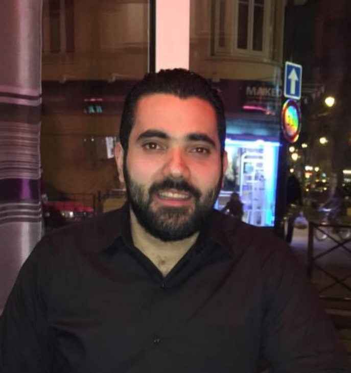

## **About Me**

- Research scientist at **CEA** - Commissariat à l'énergie atomique et aux énergies alternatives

- Lecturer at **LeCNAM** - Conservatoire National des Arts et Métiers

- ORCID: [0000-0002-3525-7063](https://orcid.org/0000-0002-3525-7063)

- Google Scholar: [elie.saikali](https://scholar.google.fr/citations?user=y7KK9cIAAAAJ&hl=en)

## **CFD code developer member**

- The open source [**TRUST**](https://github.com/cea-trust-platform/trust-code) platform (CEA DES/ISAS/DM2S/STMF/LGLS)

- The open source [**GPUSPH**](https://www.gpusph.org/) computational engine (INGV Catania, leCNAM)

## **Professional address**

- CEA, Univeristé Paris-Saclay

- DES/ISAS/DM2S/STMF/LGLS

- Bât 451, point courrier 43

- 91191 Gif-sur-Yvette Cedex, France

{: style="float: left"; margin-right: 10em; height="5%" width="5%"} ## Some Text On Left! Some Text On Left!  Some Text On Left!Some Text On Left!Some Text
